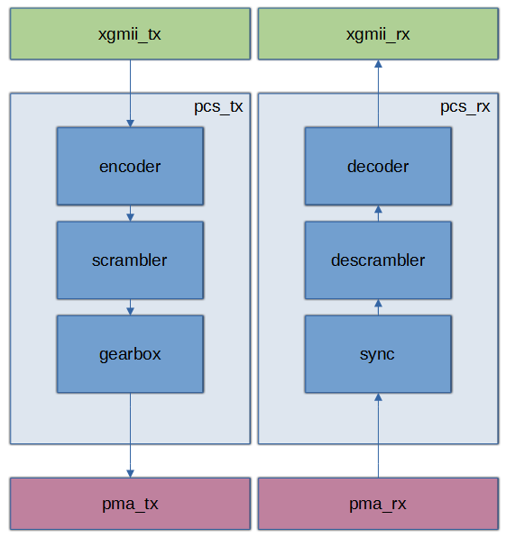

## Overview
This repo is a experiment of writing simple and low latency 10GBASE-R PCS for receiving and transmitting Ethernet packets on full 10Gbit/s speed without drop. 
PCS architecture based on IEEE Std 802.3-2008 standard and testing on Intel FPGA. Anyway, it can be easily ported for another vendors, as used standard input and output interfaces. XGMII and PMA interfaces has 32 bit width 

<p align="center">
  
</p>

## Pcs RX
### synchronization
The PCS maps XGMII signals into 66-bit blocks, and vice versa, using a 64B/66B coding scheme. 66bit block consist from 2 bit header and 64 bit data field. 

<p align="center">
  
</p>

From PMA we receive raw 32 bit words and sync block need for extract and align header and data bits. The scheme of alignment and locking is described in standard.  
### descrambling
The payload of the block is scrambled with a self-synchronizing scrambler polinomial 1+x^39+x^58. The descrambler processes the payload to reverse the effect of the scrambler using the same polynomial. There is no requirement on the initial value for the descrambler. The descrambler is run continuously on all payload bits. The sync header bits bypass the descrambler.
### decoding
10GBASE-R has special control codes for signaling start of frames, terminate frames, idle and so on. Decoder in PCS is mapping this codes and translate in XGMII interface.
## Pcs TX
PCS TX used the reverse operations as is PCS RX for packing XGMII interface in 66bit blocks and transfer it to pma output interface.
## Verification
Verification RX and TX PCS is based on connection of serial links by Intel 10Gbaser-R core and developed PCS. 

<p align="center">
  
</p>

for running tests:
```
cd ./lib/test/g10Baser_g10Pma/
make
```

list of tests:
* test_r1_lin_b64_b64_linkup - link fail test
* test_r1_lin_b1500_b1500_linkup - link fail test 
* test_r1_lin_b64_b1500_linkup - link fail test   
* test_r1_rnd_b64_b1500_linkup - link fail test 
* test_r100_lin_b64_b64 - 64 byte length packets, 100% line input rate
* test_r100_lin_b1500_b1500 - 1500 byte length packets, 100% line input rate
* test_r100_lin_b64_b1500 - 64-1500 byte length packets(linear counter), 100% line input rate
* test_r100_rnd_b64_b1500 - 64-1500 byte length packets(random), 100% line input rate
* test_r50_lin_b64_b64 - 64 byte length packets, 50% line input rate
* test_r50_lin_b1500_b1500 - 1500 byte length packets, 50% line input rate
* test_r50_lin_b64_b1500 - 64-1500 byte length packets(linear counter), 50% line input rate
* test_r50_rnd_b64_b1500 - 64-1500 byte length packets(random), 50% line input rate
* test_r10_lin_b64_b64 - 64 byte length packets, 10% line input rate
* test_r10_lin_b1500_b1500 - 1500 byte length packets, 10% line input rate
* test_r10_lin_b64_b1500 - 64-1500 byte length packets(linear counter), 10% line input rate
* test_r10_rnd_b64_b1500 - 64-1500 byte length packets(random), 10% line input rate

## Resources
## Latency
